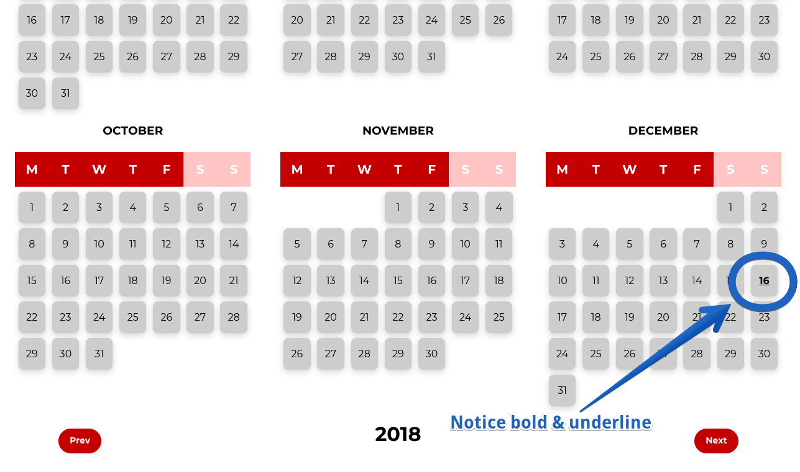
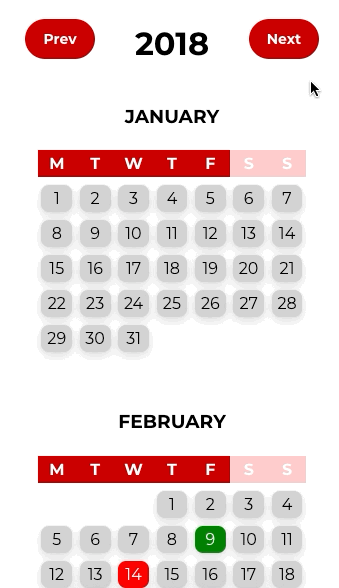
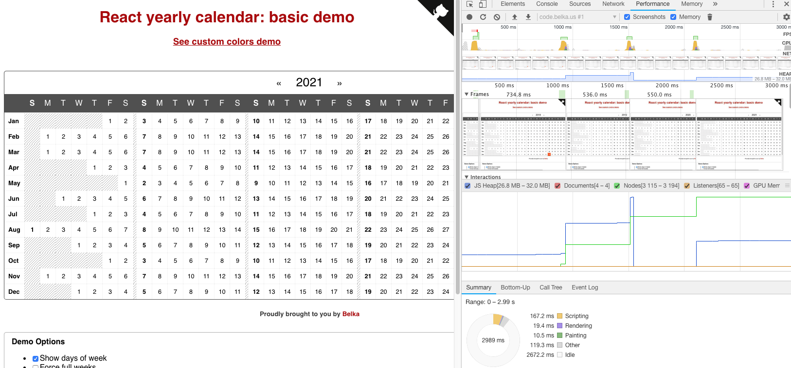

# EROAD React full year calendar assignment

## Forehead

Author: [Nick Do](https://www.linkedin.com/in/nick-do/) <br>
Licence: MIT

I would like to thank the Nik Arkharov and team at EROAD for the given exercise. <br>
Below I will outline:

- How start the local development server, run test, and build the project
- Summary on the given objectives
- My analysis for the given problem which goes into details of choice of data structure, the "ideal process", choice of technology
- How I structure the code and why I structure it in the way I do
- A little more on the design, design concept, and design systems

This project was bootstrapped with [Create React App](https://github.com/facebook/create-react-app).

## Running the code

In the project directory, you can run:

### `npm start`

Runs the app in the development mode.<br>
Open [http://localhost:3000](http://localhost:3000) to view it in the browser.

### `npm test`

Launches the test runner in the interactive watch mode.<br>

### `npm run build`

Builds the app for production to the `build` folder.<br>

## Objectives

The main objectives are summarized below.

**`achieved`** Render yearly view:
* All months
* Dates labelled with Mon-Sun on top
* All dates arranged so that it is clear to see which day of the week it is


**`achieved`** By default today date should be distinguishable from the rest of the days



**`achieved`** Ability to mark date as one of the following categories and each should have a different color:
  + Holiday
  + Birthday
  + Busy
  + Anniversary
  


  
**`achieved`** Ability to remove special categories from the date


**`achieved`** Ability to move between year without losing data




## Analysis

### Concept
I made a wid

### Components

### Data structure to store the date

### Choice of technology

## Code structure

```$xslt
src /
 "  /design system
 "  /components
 "  /logic
 "  /stories
```

`src` is the folder that contain all the relevant code <br>

`src/design system/` contains the theme, most basics components which are expected to be reused throughout the application ([Design System](https://www.invisionapp.com/inside-design/guide-to-design-systems/)). These components may be used in all the apps in your enterprise. <br>

`src/components/` contains components which overwrite the logic and styling of components from `src/design system/` to be used for the app. These may be used only for this particular app.<br>

`src/logic` contains helper functions and constant apply only to this particular application

`src/stories` contain an interactive UI component library. Check out [storybook](https://github.com/storybooks/storybook).

## Comments

### I try to "organically grow" my components as much as possible
One in 8 open source project has some sort of vulnerability. Each one of they may use a different styling engine, be it pure CSS, SASS, LESS, CSS-in-JS. 
It can hard to keep track of the changes and customize for each of the external dependants.
Thus, depending on some components on the internet that someone builds for their hobby with people using and testing them is not a good idea.

The way I went about doing this is to build my own `Design System` from ones that I like. 
It may take sometimes to read their code and understand what I like to keep and what I like to change but its worth it for the long term ([Source](https://airbnb.design/building-a-visual-language/)).

One thing that bugs me about experience with React is that components are not reusable enough.
Components are often embedded with their unique styling and logic. Therefore most basics building blocks are not consistent.
Not having to rework the responsive system for each of the components, and having static shortcut for styling are two benefits that a `Design System` can offer.

Another thing I noticed that I should do properly from the start of the exercise is how make sure all the boxes are perfectly aligned and responsive.
I have always been curious on how to build a design system, and I took this opportunity to explore.
As I expected, having a `Design System` programmable responsive structure turned out fantastic.

The library that offered a programmable responsive system is [styled-system](https://github.com/jxnblk/styled-system).
I also learned a lot on how to build a `Design System` from [Priceline Design System](https://github.com/pricelinelabs/design-system) and [Hackclub Design System](https://github.com/hackclub/design-system).

### Fine tuning
I initially tried to make the app just to work, then work fast, then work beautifully.

The part where I made it look good is self-explanatory, I just went and change some CSS-in-JS.

When the app were fully functional, each time a date change its type of event (Busy/Holiday ...), it takes roughly *500ms* on my laptop. 
One solution that I have considered is to use `React shouldComponentUpdate()` to prevent excessive updates.
However, the  `React` comes with `PureComponent` which automatically looks for `props & state` changes. I choose this solution instead because of its simplicity.
After changing smaller components which have their own `state` & `props` such as`<MonthCalendar />`, the app state changes significantly improved. 
Now, each changes to the date events takes less than *200ms* which is acceptable considering the `<App/>` component keeps a hold of all days of the year, including the events.

One part where the performance can still improve is when the user switches year. All the days are now positioned differently in each `<MonthCalendar/>`.
This causes almost all the `<DayBoxGroup/>` components to rerender and there is no solution obvious to me to shorten this render step.
I have already investigated whether generating the position of `<DayBoxGroup/>` cause an issue, but this skeleton building step takes less than *10ms*.
Another `React` library that I looked into also has this problem.
[React-yearly-calendar](https://github.com/BelkaLab/react-yearly-calendar) also takes roughly *500ms*
 to render when user change the year. **If you have a solution to improving this please do let me know.**

